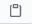
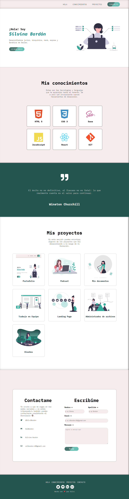

# **Portafolio de Silvina Bordón** 💕
 
Este es mi Portafolio personal donde podrás encontrar no solo que lenguajes y tecnologias manejo, sino tambien los proyectos desarrollados durante mi formación.

#### Si quieres verlo puedes hacer click en este [enlace](https://silbordon.github.io/Portfolio/) o puedes verlo desde [aca](https://silly-wozniak-52de89.netlify.app/)

***

## **Instalación** 👈🏻

### Para clonar este repositorio tienes que seguir estos pasos:

 

 - Ir al [repositorio](https://silbordon.github.io/Portfolio/)  
 - Hacer click al botón de 
 - Hacer click al botón de 

 - Copiar la URL haciendo click al boton 
 - Abrir tu terminal y poner el comando de *git clone url*
 - Entrar a la carpeta del proyecto y abrirlo en tu IDE

*Este proyecto no necesita dependencias (por ahora).*

 

### **Asi es como se debería ver el Proyecto**

 

 

***

## **Agradecimiento** 🥰😘

- Quiero agradecer a nuestro profe [Jonh](https://github.com/Jonhks) y a [Leydy](https://github.com/leydyk93) por su paciencia y ayuda constante para que podamos aprender, y a todas mis compañeras por el apoyo diario.

- A mi esposo por ser mi soporte todos los dias, recordandome que nunca es tarde para aprender cosas nuevas y por ayudarme a recorrer el maravilloso mundo de la programación.

#### *De Silvi con ❤*

  
